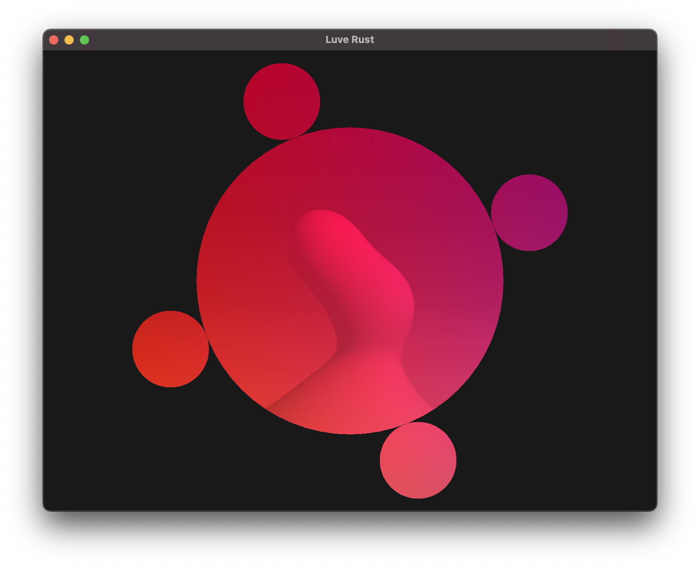

# Luve Rust

A project I created to learn a new language : [Rust](https://www.rust-lang.org) !

## ⚠️ Prerequisite ⚠️

You need to have `cmake` installed on your os !

## Run

The shader Proof of Concept:

    cargo run --bin use_shader

Be sure to perform this command in the root directory because of this line: `let vs = "./shaders/simple.vert";`.

Run the ants algorithm:

    cargo run --bin ants_algorithm
